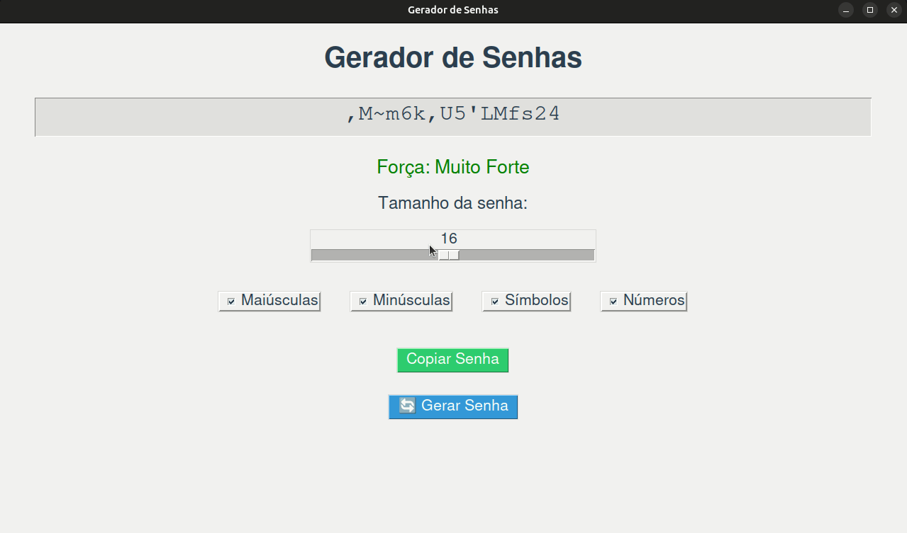

# Gerador de Senhas



Um aplicativo simples de gerador de senhas utilizando Tkinter em Python. Este programa permite aos usuários criar senhas seguras de forma fácil, personalizando os critérios de complexidade, como comprimento e tipos de caracteres.

## Funcionalidades

- **Geração de Senhas**: Crie senhas aleatórias com diferentes combinações de letras maiúsculas, minúsculas, números e símbolos.
- **Avaliação de Força da Senha**: Receba feedback instantâneo sobre a força da senha gerada.
- **Cópia para Área de Transferência**: Copie a senha gerada para a área de transferência com um clique.
- **Interface Intuitiva**: Uma interface gráfica fácil de usar que permite escolher rapidamente as opções desejadas.

## Requisitos

- Python 3.12.3
- Tkinter (geralmente incluído nas distribuições padrão do Python)

## Como Usar

1. Clone ou baixe este repositório.
2. Abra o terminal ou o prompt de comando e navegue até a pasta onde o arquivo está localizado.
3. Execute o programa com o seguinte comando:

   ```bash
   python gerador_de_senhas.py
   ```

4. Utilize a barra deslizante para escolher o tamanho da senha desejada.
5. Selecione as opções para incluir letras maiúsculas, minúsculas, números e símbolos.
6. Clique no botão "🔄 Gerar Senha" para criar uma nova senha.
7. Para copiar a senha gerada, clique em "Copiar Senha".

## Contribuições

Contribuições são bem-vindas! Sinta-se à vontade para abrir um problema ou enviar um pull request.
